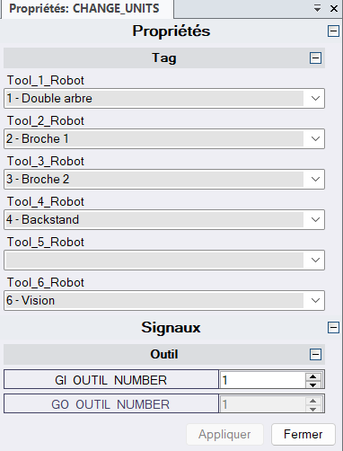
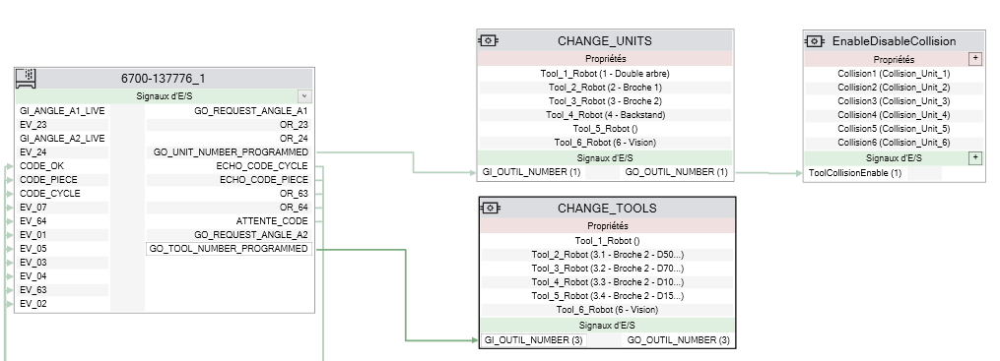

# ChangeTool

Le composant ChangeTool permet d'activer ou de désactiver un jeu de collision Robostudio à partir des entrées/sorties robot

> [!NOTE]
> L'application utilise ROBOTSTUDIO SDK ABB ➡️ https://developercenter.robotstudio.com/

## 1 - TELECHARGER

Importer le composant ➡️ [ChangeTool.rslib] (https://github.com/tonycab/ChangeTool/releases/tag/v1.0)

## 2 - COMMENCER

Parametrer le composant en sélectionnant les objets graphiques que vous souhaitez masquer ou afficher:

<!-- Capture -->

    

Relier les entrées sorties au composant :
<!-- Capture -->

    

## 3 - AMELIORATION A FAIRE

## 4 - INFORMATIONS

(<a href="#readme-top">Back to top</a>)

